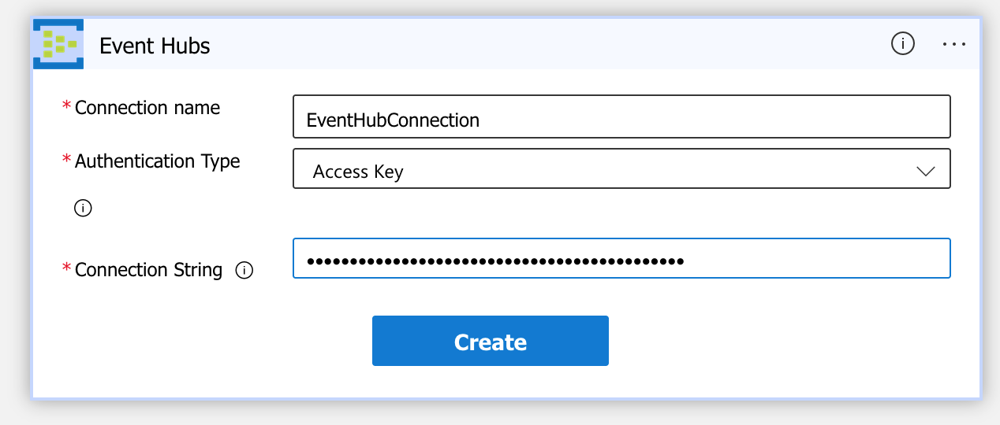
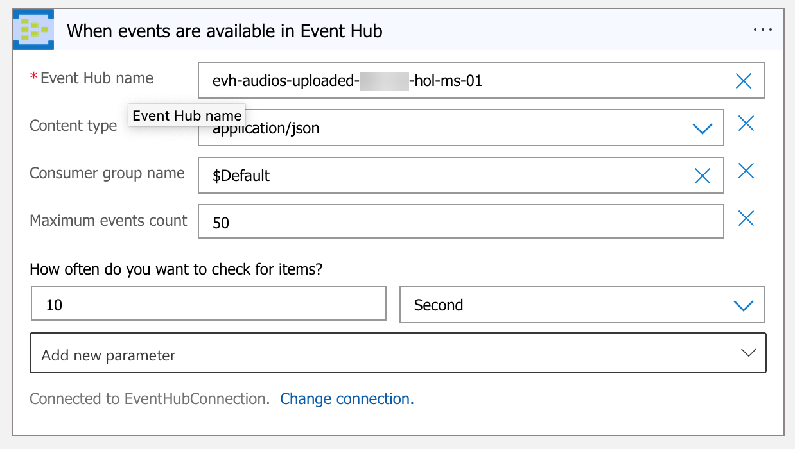
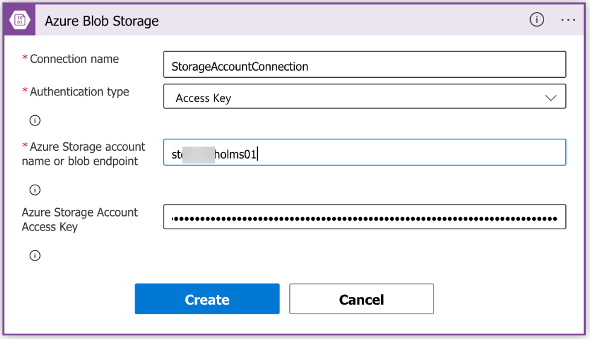
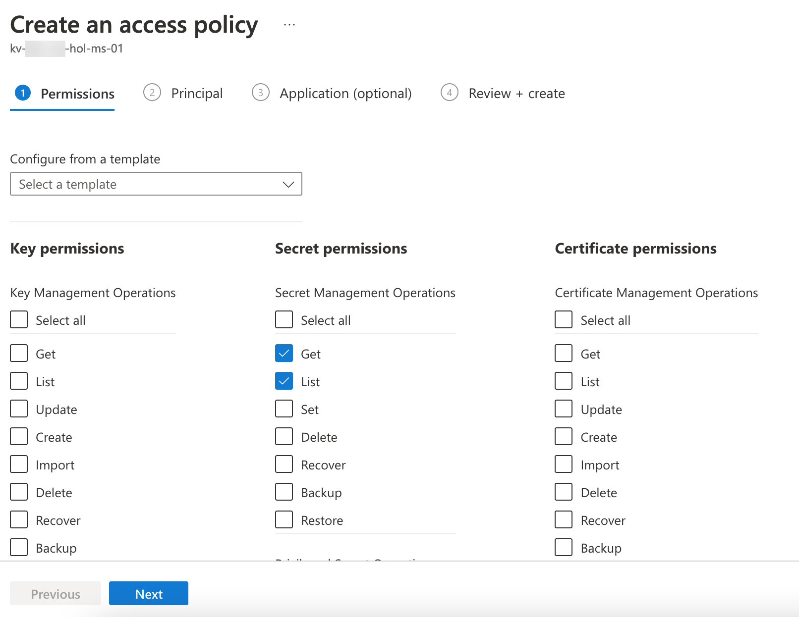
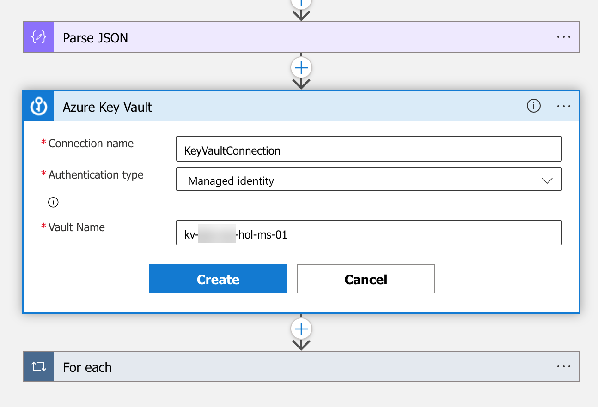
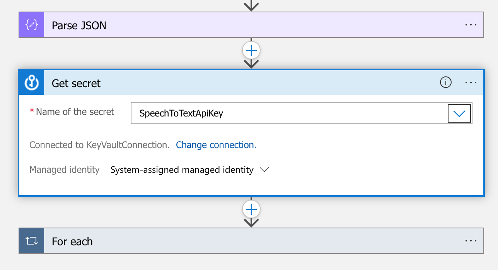
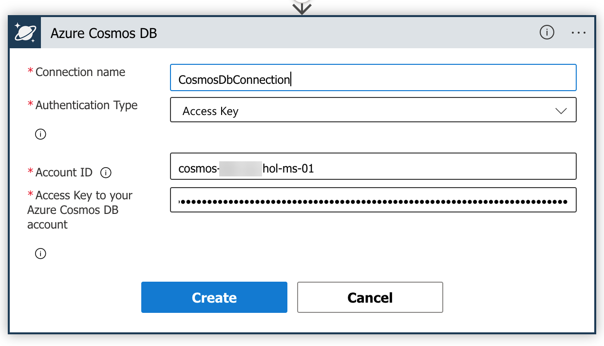
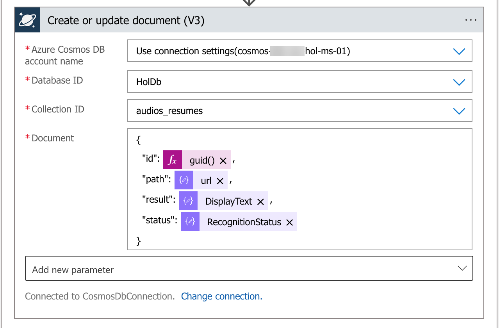

# The Serverless Workshop

## Before you start

Welcome to this Azure Serverless Workshop. In this lab, you will use different types of serverless services on Azure to achieve a real world scenario. Don't worry, this is a step by step lab, you will be guided through it.

During this workshop you will have the instructions to complete each steps, try to find the answer before looking at the solution.

---

# The Workshop

## Prerequisites

Before starting this workshop, be sure you have:

- An Azure Subscription with **enough right** to create and manage services
- The [Azure CLI][az-cli-install] installed on your machine
- The [Azure Functions Core Tools][az-func-core-tools] installed, this will be useful for creating the scaffold of your Azure Functions using command line.
- If you use VS Code you can also install the [Azure Function extension][azure-function-vs-code-extension]

<div class="task" data-title="Task">

> Before starting, login to your Azure subscription locally using Azure CLI and inside the [Azure Portal][az-portal] using your own credentials.

</div>

<details>
<summary>Toggle solution</summary>

```bash
# Login to Azure
az login
# Display your account details
az account show
# Select a specific subscription if you have more than one or the wrong one selected
az account set --subscription <subscription-id>
```

</details>

## Scenario

The goal of the lab is to upload an audio file to Azure and receive the content inside a Single Page Application. Here is a diagram to explain it:


1) The user upload the audio file from the Web application
2) The web application communicate with an APIM (API Management) which is a facade for multiple APIs
3) An Azure Function which works as a simple API will upload the file to a Storage Account.
4) When the file is uploaded the Event Grid service will detect it and send a "Blob created event" to an Event Hub
5) The Event Hub will be consumed by a Logic App 
6) The Logic App retreive the new audio file
7) The audio file is sent to the Azure cognitive service.
8) The speech to text service will proceed the file and return the result to the Logic App.
9) The Logic App will then store the text from the audio file inside a Cosmos Db database
10) An other Azure Function will listen to this Cosmos Db and get the text just uploaded 
11) The Azure Function send it to the Web pub/sub service.
12) Finally the Web pub/sub service which works like a websocket will notify the Web Application with the content of the audio file.

<div class="info" data-title="Note">

> The Azure Key Vault will be used to store the different secrets needed for this scenario.

</div>

You will get more details about each of these services during the Hands On Lab.

## Naming convention

Before starting to deploy any Azure services, it's important to follow a naming convention. Based on the official [documentation][az-naming-convention] we need to define a few things:

- The application name
- The environment
- The region
- The instance number

We will also add an owner property, so for the purpose of this lab the values will be:

- The application name: `hol` (for Hands On Lab)
- The environment: `dev`
- The region: `we`
- The instance: `01`
- The owner: `ms`

So we will use this convention:

```xml
<!--If the resource prefix has a dash: -->
<service-prefix>-<environment>-<region>-<application-name>-<owner>-<instance>
<!--If the resource does not autorize any special caracters: -->
<service-prefix><environment><region><application-name><owner><instance>
```

<div class="info" data-title="Note">

> Be sure to use your own value to have unique names or use your own convention. 
> [Official resource abbreviations][az-abrevation]

</div>

With everything ready let's start the lab!

[az-cli-install]: https://learn.microsoft.com/en-us/cli/azure/install-azure-cli
[az-func-core-tools]: https://learn.microsoft.com/en-us/azure/azure-functions/functions-run-local?tabs=v4%2Clinux%2Ccsharp%2Cportal%2Cbash#install-the-azure-functions-core-tools
[az-naming-convention]: https://learn.microsoft.com/en-us/azure/cloud-adoption-framework/ready/azure-best-practices/resource-naming
[az-abrevation]: https://learn.microsoft.com/en-us/azure/cloud-adoption-framework/ready/azure-best-practices/resource-abbreviations
[az-portal]: https://portal.azure.com
[vs-code]: https://code.visualstudio.com/
[azure-function-vs-code-extension]: https://marketplace.visualstudio.com/items?itemName=ms-azuretools.vscode-azurefunctions

---

# Lab 1

For this first part, you will be focus on this part of the scenario:


## Create a resource group

Let's start by creating the resource group for this Hand's On Lab.

<div class="info" data-title="Information">

> For the purpose of this lab we will create all the resources in the same region, for instance West US (westus) or West Europe (westeurope).

</div>

Remember, the naming convension for resource groups will be: `rg-<environment>-<region>-<application-name>-<owner>-<instance>`

<div class="task" data-title="Resources">

> [Resource Groups][resource-group]

</div>

[resource-group]:https://learn.microsoft.com/fr-fr/cli/azure/group?view=azure-cli-latest

<details>
<summary>Toggle solution</summary>

```bash
# Use az account list-locations to get a location:

az account list-locations -o table

# Then create the resource group using the selected location:

az group create --name <resource-group> --location <region>
```

</details>

## Configure the storage account

With the resource group ready, let's create a storage account with a container named `audios` that will store all audios. The naming convention for Storage Accounts is: `st<environment><region><application-name><owner><instance>`.

Choose a Locally redundant storage: Standard LRS

<div class="task" data-title="Resources">

> [Storage Account][storage-account]<br>
> [Storage Account Container][storage-account-container]

</div>

[storage-account]:[https://learn.microsoft.com/fr-fr/cli/azure/storage/account?view=azure-cli-latest]
[storage-account-container]:[https://learn.microsoft.com/fr-fr/cli/azure/storage/container?view=azure-cli-latest]

<details>
<summary>Toggle solution</summary>

```bash
# Create the Storage Account with Standard LRS

az storage account create -n <storage-account-name> \
                          -g <resource-group> \
                          -l <region> \
                          --sku Standard_LRS
```

Based on the command line below, to create the container for the audios files you need to get one of the access key:


```bash
# Then create the audios container inside it

az storage container create -n audios \
                            --account-name <storage-account-name> \
                            --account-key <storage-account-key>
```

If everything is fine, open the [Azure Portal][az-portal] and you will retreive your container:


</details>

[az-portal]: https://portal.azure.com


## Detect the audio uploaded

### Create an Event Grid

Next step is to setup a way to listen to the audios files uploaded by the user in the storage account container. To start, we will upload them directly using the [Azure Portal][az-portal] and further in the lab we will use a user interface and a dedicated API.

To detect the upload you will use a service called Event Grid, and use the `System topic`.

The naming convention for Event Grid topics is: `egst-<environment>-<region>-<application-name>-<owner>-<instance>`.

<div class="task" data-title="Resources">

> [Event Grid][event-grid]

</div>

[event-grid]:https://learn.microsoft.com/en-us/cli/azure/eventgrid/system-topic?view=azure-cli-latest

<details>
<summary>Toggle solution</summary>

```bash
# Create the Event Grid system topic
az eventgrid system-topic create -g <resource-group> \
                                 --name <event-grid-system-topic-name> \
                                 --location <region> --topic-type microsoft.storage.storageaccounts \
                                 --source /subscriptions/<subscription-id>/resourceGroups/<resource-group>/providers/Microsoft.Storage/storageAccounts/<storage-account-name>
```

</details>

### Create an Event Hub

The Event Grid previously created will listen to the Storage Account, but before adding this mecanism we need to create another service: The Event Hub. This one is responsible for broadcasting the event creating by the Event Grid service. With that in placethe event can be consumed by multiple services. In our case, a Logic App will be triggered based on the Event Hub broadcasting.

The naming convention for Event Hub Namespace is: `evhns-<environment>-<region>-<application-name>-<owner>-<instance>` and for the event hub: `evh-audios-uploaded-<environment>-<region>-<application-name>-<owner>-<instance>`.

- Use the `Basic` SKU for the Event Hub Namespace.
- Define the message retention to 1 and partition count to 2 for the Event Hub.

<div class="task" data-title="Resources">

> [Event Hubs Namespace][event-hubs-namespace]<br>
> [Event Hubs Event][event-hubs-event]

</div>

[event-hubs-namespace]:https://learn.microsoft.com/en-us/cli/azure/eventhubs/namespace?view=azure-cli-latest
[event-hubs-event]:https://learn.microsoft.com/en-us/cli/azure/eventhubs/eventhub?view=azure-cli-latest

<details>
<summary>Toggle solution</summary>

```bash
# Create the Event Hub Namespace
az eventhubs namespace create --resource-group <resource-group> \
                              --name <event-hub-namespace> \
                              --location <region> \
                              --sku Basic 

# Create the Event Hub Instance
az eventhubs eventhub create --resource-group <resource-group> \
                             --namespace-name <event-hub-namespace> \
                             --name <event-hub-name> \
                             --message-retention 1 \
                             --partition-count 2
```


</details>

### Add an Event Subscription

Now, you will need to subscribe to the Storage Account with your Event Grid and use the Event Hub as a broadcaster.
To achieve this, you need to meet these triggers criterias:
- Only on blob creation
- If the file is uploaded in the `audios` container otherwise ignore it
- If the file extension is `.wav`
- The Event Grid trigger the Event Hub

The naming convention for Event Subscription is: `evgs-audios-uploaded-<environment>-<region>-<application-name>-<owner>-<instance>`

<div class="tip" data-title="tip">

> To get access to the identifier of a resource, go to the `Overview` tab and click en `Json View` on the top right and you will see it.

</div>

<div class="task" data-title="Resources">

> [Event Grid Topic Subscription][event-grid-topic-subscription]

</div>

[event-grid-topic-subscription]:https://learn.microsoft.com/en-us/cli/azure/eventgrid/system-topic/event-subscription?view=azure-cli-latest

<details>
<summary>Toggle solution</summary>

```bash
# Create the event grid system topic subscription
az eventgrid system-topic event-subscription create --name <event-grid-system-topic-subscription-name> \
                                             -g <resource-group> \
                                             --system-topic-name <event-grid-system-topic-name> \
                                             --event-delivery-schema eventgridschema \
                                             --included-event-types Microsoft.Storage.BlobCreated \
                                             --subject-begins-with /blobServices/default/containers/audios/blobs \
                                             --subject-ends-with .wav \
                                             --endpoint-type eventhub \
                                             --endpoint /subscriptions/<subscription-id>/resourceGroups/<resource-group>/providers/Microsoft.EventHub/namespaces/<event-grid-system-topic-name>/eventhubs/<event-hub-name>
```

If you did everything correctly you should see the event subscription like this:


</details>


## Process the event

### Create the Logic App

The action of uploading an audio file is now exposed by the event hub. It's time to consume this event.

Let's create a Logic App in consumption mode which is triggered by the event hub every 10 seconds.

The default workflow to use is:

```json
{
    "definition": {
        "$schema": "https://schema.management.azure.com/providers/Microsoft.Logic/schemas/2016-06-01/workflowdefinition.json#",
        "actions": {},
        "contentVersion": "1.0.0.0",
        "outputs": {},
        "parameters": {},
        "triggers": {}
    },
    "parameters": {}
}
```

The naming convention for Logic Apps is: `logic-<environment>-<region>-<application-name>-<owner>-<instance>`

<div class="task" data-title="Resources">

> [Azure Cli Extension][azure-cli-extension]<br>
> [Azure Logic App][azure-logic-app]

</div>

[azure-cli-extension]:https://learn.microsoft.com/en-us/cli/azure/azure-cli-extensions-overview
[azure-logic-app]:https://learn.microsoft.com/en-us/cli/azure/logic/workflow?view=azure-cli-latest

<details>
<summary>Toggle solution</summary>

```bash
# Install the logic extension
az extension add --name logic

# Create a logic app in consumption mode
az logic workflow create --resource-group <resource-group> 
                         --location <region> 
                         --name <logic-app-name> 
                         --definition <path-to-default-workflow.json>
```

</details>

### Trigger the logic app

Next step is to trigger the Logic App based on the Event Hub when a file is uploaded to the audios container.

A basic audio file to test the trigger can be download here:
[Audio demo](assets/whatstheweatherlike.wav)

<div class="task" data-title="Resources">

> [Logic Apps Triggers][logic-apps-triggers]

</div>

[logic-apps-triggers]:https://learn.microsoft.com/en-us/azure/connectors/connectors-create-api-azure-event-hubs

<details>
<summary>Toggle solution</summary>

In the [Azure Portal][az-portal] inside the Logic App just created click on the `Edit` button. Then select `Blanc Logic App`. In the triggers list search for `Event Hub` and select the `When events are available in Event Hub` trigger.

You will need to go to the `Shared Access Policies` inside your event hub to create an access key with `Listen` *only* property:


With that done, you will be able to connect to the Event Hub using the primary or secondary connection string:



Next step, you can configure the event hub trigger:



Finally, if you upload a file in the audios container, after a few seconds, if you look at your logic app `Runs history` you will see a succeeded status.
</details>

[az-portal]: https://portal.azure.com

### Download the blob

With the trigger ready, you need to extract the audios blob path and prepare it to be consumed by the cognitive services.

<div class="task" data-title="Resources">

> [Logic Apps Consumption mode][logic-app]<br>
> [Logic App Storage Account Action][logic-app-storage-action]<br>

</div>

[logic-app]:https://learn.microsoft.com/en-us/azure/logic-apps/logic-apps-perform-data-operations?tabs=consumption#parse-json-action
[logic-app-storage-action]:https://learn.microsoft.com/en-us/azure/connectors/connectors-create-api-azureblobstorage?tabs=consumption

<details>
<summary>Toggle solution</summary>

First thing to do is to parse the json content. To do so, search for `parse json` in the workflow editor and choose the content input with `Content` which is the event hub content data. 
For the schema part, just click on `Use sample payload to generate schema` and copy paste one of the json object inside the output `Content` received from a previous successfull run.


Because the Content is an array, you need to loop over it for the next action. To do so, search `For each` action and then select `Body` as input.


Then, search for `Azure Blob Storage` and select the `Get blob content using path (V2)` action. As we did previously, create a connection service with the `Access Keys` of the Storage account:



Finally, update the information to get the path of the audio file just uploaded using a `split` query:

```js
split(items('For_each')['data']['url'], '.blob.core.windows.net')[1]
```


</details>

### Use the cognitive services

Next step is to transform the audio file into text using the cognitive service with the speech to text service. 
To do this, you will have to:
- Instanciate the cognitive service
- Call the speech to text API

<div class="important" data-title="Security">

> Remember to store secrets values if necessary in a Key Vault before using them.

</div>

The naming conventions are:
- Cognitive services: `cog-<environment>-<region>-<application-name>-<owner>-<instance>`
- Key Vault: `kv-<environment>-<region>-<application-name>-<owner>-<instance>`

<div class="task" data-title="Resources">

> [Cognitive service][cognitive-service] <br>
> [Key Vault][key-vault] <br>
> [Cognitive Service Api][cognitive-service-api]

</div>

[cognitive-service]:https://learn.microsoft.com/en-us/cli/azure/cognitiveservices/account?view=azure-cli-latest
[key-vault]: https://learn.microsoft.com/fr-fr/cli/azure/keyvault?view=azure-cli-latest
[cognitive-service-api]:https://learn.microsoft.com/en-us/azure/cognitive-services/speech-service/get-started-speech-to-text?tabs=macos%2Cterminal&pivots=programming-language-rest

<details>
<summary>Toggle solution</summary>

```bash
# Let's create the cognitive service account with speech to text service
az cognitiveservices account create -n cog-dev-we-hol-ms-01 -g rg-dev-we-hol-ms-01 --kind SpeechServices --sku F0 -l WestEurope --yes
# Create the Key Vault to secure the speech to text API key
az keyvault create --location westeurope --name kv-dev-we-hol-ms-01 --resource-group rg-dev-we-hol-ms-01
```

To allow the Logic App to access the Key Vault, you need to grant access to it. Go to your Logic App and inside the identity tab, turn on the `System Identity`:


Then in your Key Vault, go to `Access policies` and create a new one, set the Secret access to `Get` and `List`:



Then search for your logic app.


Now inside your Key Vault, in the `Secret` section add a new one called: `SpeechToTextApiKey` and set a key from the cognitive service.


With all of these ready, add a new action before the loop by searching for `Key Vault` and then select `Get Secret`. This will load the speech to text API key once. 



Select the Key Vault and the name of the secret.



With that ready, add a new action in the for loop by searching for `Http`, then fill the different parameters like this:


Notice the region of your cognntive service account and the language to use is specified in the url.

Finally as you need previously, upload the audio file and you should see the content as a text.

</details>

### Store data to Cosmos Db

With the audio transformed to text, you will have to store it in a NoSQL database inside Cosmos Db:
- Database info: `HolDb`
- Collection to store the texts: `audios_resumes`

The naming conventions for Cosmos Db account is `cosmos-<environment>-<region>-<application-name>-<owner>-<instance>`

<div class="info" data-title="Resources">

> [Cosmos Db][cosmos-db]

</div>

[cosmos-db]: https://learn.microsoft.com/en-us/azure/cosmos-db/scripts/cli/nosql/serverless

<details>
<summary>Toggle solution</summary>

```bash
# Create the Cosmos Db account using serverless
az cosmosdb create --name <cosmos-db-account-name> \
                   --resource-group <resource-group> \
                   --default-consistency-level Eventual \
                   --locations regionName="<region>" \
                   failoverPriority=0 isZoneRedundant=False \
                   --capabilities EnableServerless

# Instanciate the database inside it
az cosmosdb sql database create --account-name <cosmos-db-account-name> \
                                --resource-group <resource-group> \
                                --name HolDb

# Create the item collection
az cosmosdb sql container create --account-name <cosmos-db-account-name> \
                                 --resource-group <resource-group> \
                                 --database-name HolDb \
                                 --name audios_resumes \
                                 --partition-key-path "/id"
```

In the last run of your Logic App just look at the output body of your HTTP action and you should see something like this:

```json
{
  "RecognitionStatus": "Success",
  "Offset": 1500000,
  "Duration": 32400000,
  "DisplayText": "What's the weather like?"
}
```

Copy it, and like previously add a `Parse Json` action into the Logic App and use this as a "Sample payload to generate schema" and chose the `Body` response as input:


Then add a new action, search for `Cosmos Db` and select `Create or update document (V3)`:

Create the connection with your Cosmos Db Instance:



Finally, it's time to compose the document object to insert using JSON:

```json
{
  "id": <guid-here>,
  "path": <audio-file-storage-account-path>,
  "result": <cognitive-service-text-result>,
  "status": <cognitive-service-status-result>
}
```



Give a try and fortunately, you will see a new item in your Cosmos Db!

</details>

## Add an API

### Azure Function

At this point you have the first sceneario quite complete. The last thing you need to add is an API to upload the audio file to your storage account. For this step you will use `Azure Functions`.

Make sure to create one Azure Function with:
- The `Linux` Operating System
- A plan type set to `Consumption (Serverless)`
- The language the most confortable for you

For the answer, the Azure Function will be done in Python.

The naming formats to use are:
For the Azure function: `func-<environment>-<region>-<application-name>-<owner>-<instance>`
For the storage account associated to it: `stfunc<environment><region><application-name><owner><instance>`


<div class="info" data-title="Resources">

> [Azure Functions][azure-function]<br>
> [Azure Function Core Tools][azure-function-core-tools]<br>
> [Basics of Azure Functions][azure-function-basics]<br>

</div>

<details>
<summary>Toggle solution</summary>

```bash
# Create an Azure storage account dedicated to the Azure Function (This will be used to store files cache...)
az storage account create --name <function-storage-account-name> \
                          --location <region>  \
                          --resource-group <resource-group> \
                          --sku Standard_LRS

# Create a serverless function app in the resource group.
az functionapp create --name <function-name> \ 
                      --storage-account <function-storage-account-name> \ 
                      --consumption-plan-location <region>
                      --runtime python
                      --os-type Linux
                      --resource-group <resource-group> \
                      --functions-version 4
```

You must create a storage account dedicated to your Azure Function in order to not mix the audios files and the Azure Function specificities.

For the coding part, let's create a function using the [Azure Function Core Tools][azure-function-core-tools], **create a folder** and then run:

```bash
func new
```

Then select `python` and `Http Trigger`, name your function `AudioUpload`. Open the project inside VS Code and then:

Create a dev environment for the project:

```sh
python3 -m venv .venv
```

This will ensure the packages needed for your project are installed only for it.

Then, activate the dev environment:

```sh
# Linux
source .venv/bin/activate

# Windows
.\.venv\Scripts\activate
```

Install python packages for the project:
```sh
pip install -r requirements.txt
```

- Create a `func.py` at the same level of `__init__.py`. 
- Copy all the content of `__init__.py` into `func.py`.
- Leave the `__init__.py` empty, this is mandatory for Python to find the files in that foler

Update the `function.json` with two environment variables:
- the storage account container
- the Storage Account connection string.

And don't forget to change the `scriptFile` to use `func.py`:

```json
{
  "scriptFile": "func.py",
  "bindings": [
    {
      "authLevel": "function",
      "type": "httpTrigger",
      "direction": "in",
      "name": "req",
      "methods": [
        "post"
      ]
    },
    {
      "type": "http",
      "direction": "out",
      "name": "$return"
    },
    {
      "name": "outputblob",
      "type": "blob",
      "path": "%STORAGE_ACCOUNT_CONTAINER%/audio.wav",
      "connection": "STORAGE_ACCOUNT_CONNECTION_STRING",
      "direction": "out"
    }
  ]
}
```

Go to [Azure Portal][az-portal] and go to the `Configuration` and update the app settings with the `STORAGE_ACCOUNT_CONTAINER` to `audios` and get a connection string from the storage account with your audios container and set the `STORAGE_ACCOUNT_CONNECTION_STRING`.

Update the `func.py` to:

```python
import logging

import azure.functions as func

def main(req: func.HttpRequest, outputblob: func.Out[bytes]) -> func.HttpResponse:
    for input_file in req.files.values():
        filename = input_file.filename
        contents = input_file.stream.read()

        logging.info('Filename: %s' % filename)
        outputblob.set(contents)

    return func.HttpResponse(
        "This HTTP triggered function executed successfully.",
        status_code=200
    )
```

Deploy your function using the VS Code extension or by command line:

```bash
func azure functionapp publish func-<environment>-<region>-<application-name>-<owner>-<instance>
```

Let's give a try using Postman:


</details>

[az-portal]: https://portal.azure.com
[azure-function]: https://learn.microsoft.com/en-us/cli/azure/functionapp?view=azure-cli-latest
[azure-function-core-tools]: https://learn.microsoft.com/en-us/azure/azure-functions/functions-run-local?tabs=v4%2Cwindows%2Ccsharp%2Cportal%2Cbash
[azure-function-basics]: https://learn.microsoft.com/en-us/azure/azure-functions/supported-languages

---

# Lab 2

Coming soon...