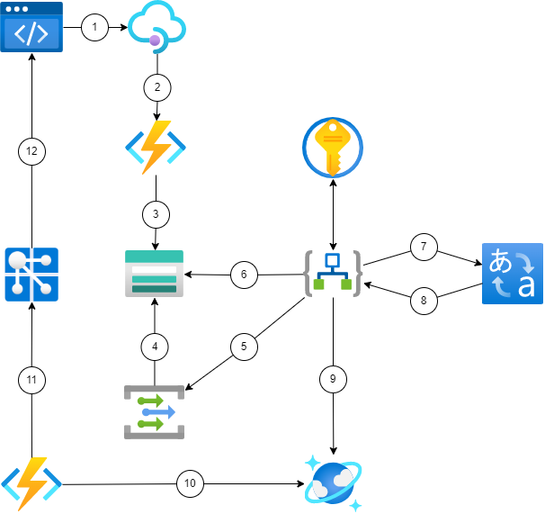
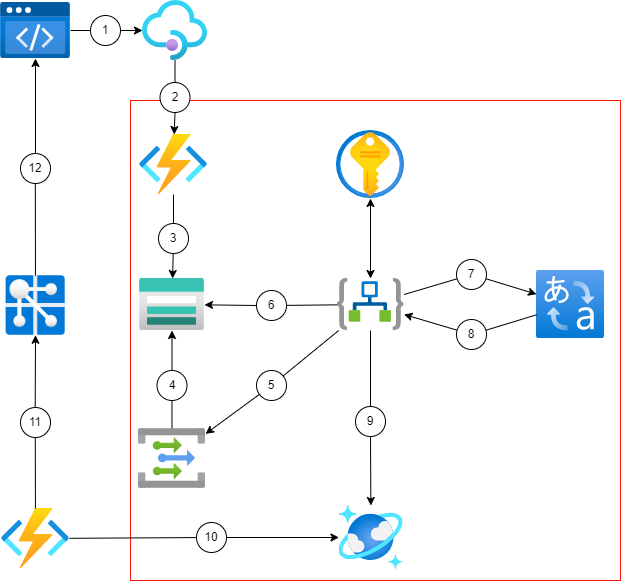
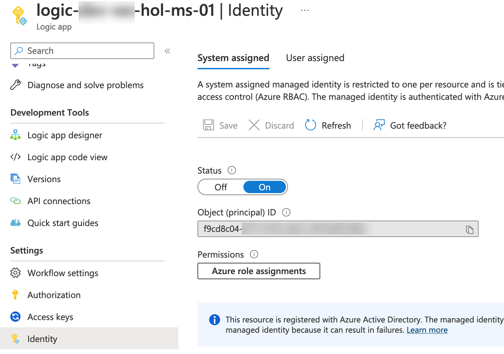
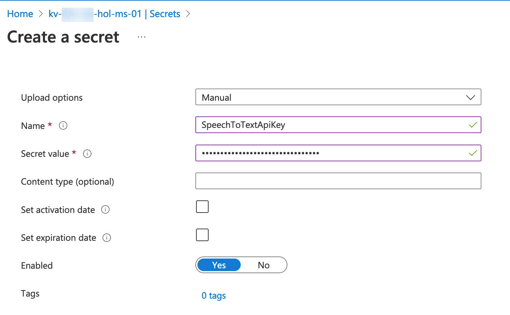
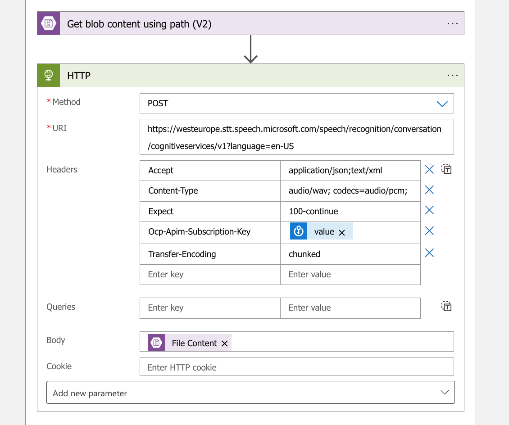
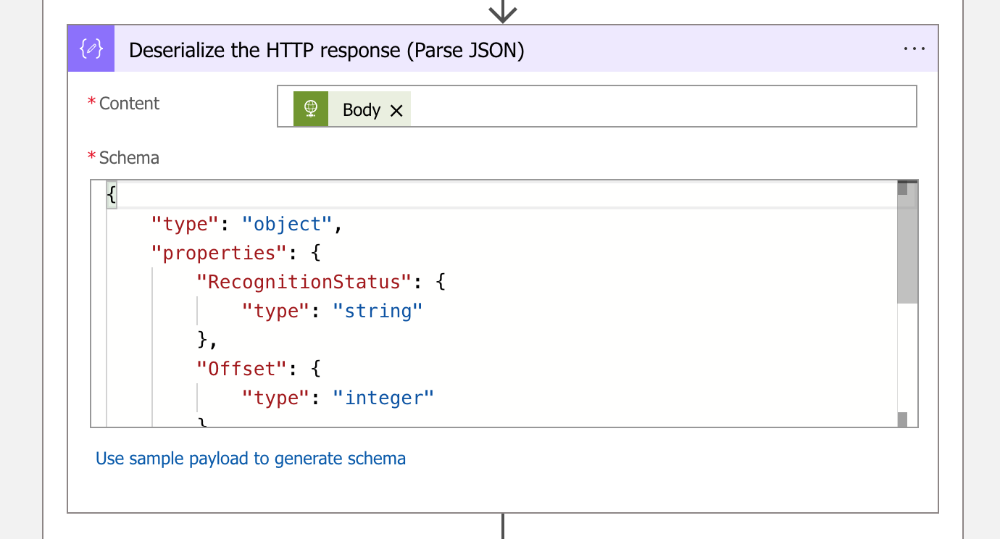
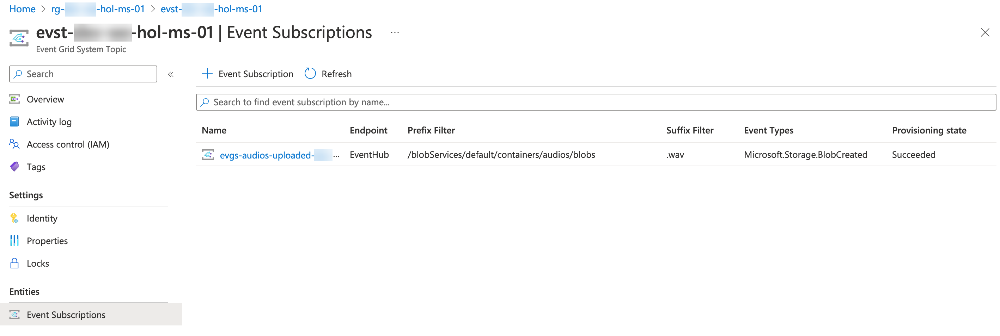

# The Serverless Workshop
<!-- TODO : Rappeler qu'il existera différents labs à terme. -->
Welcome to this Azure Serverless Workshop. You'll be experimenting with Azure Serverless services in connected labs to achieve a real world scenario. Don't worry, even if the challenges will increase in difficulty, this is a step by step lab, you will be guided through the whole process.

During this workshop you will have the instructions to complete each steps, try to search for the answers in provided resources and links before looking at the solutions placed under the 'toggle solution' panel.

---

# The Workshop

## Prerequisites

Before starting this workshop, be sure you have:

<!--  TODO : Remind what Serverless is : Event based (explain what we have : EVG , EH, SB), Main Compute Services, Storage Account, Cognitive Services, Data Services not taken into account for the workshop.
      TODO : "Did you know that basic storage accounts are one of the first serverless"
      Resources :
      - https://learn.microsoft.com/en-us/dotnet/architecture/serverless/azure-serverless-platform
      - https://azure.microsoft.com/en-us/solutions/serverless/
      Pourquoi on présenter Serverless  -->

- An Azure Subscription with the `Contributor` role to create and manage the labs resources
- The [Azure CLI][az-cli-install] installed on your machine
- The [Azure Functions Core Tools][az-func-core-tools] installed, this will be useful for creating the scaffold of your Azure Functions using command line.
- If you are using VS Code, you can also install the [Azure Function extension][azure-function-vs-code-extension]
- Register the Azure providers: `Microsoft.Logic`, `Microsoft.EventGrid`, `Microsoft.EventHub`
  
<div class="task" data-title="Task">

> Before starting, log into your Azure subscription locally using Azure CLI and on the [Azure Portal][az-portal] using your own credentials.

</div>

<details>
<summary>Toggle solution</summary>

```bash
# Login to Azure
az login
# Display your account details
az account show
# Select a specific subscription if you have more than one or another one selected
az account set --subscription <subscription-id>

# Register the following Azure providers if they are not already 

# Azure Functions 
az provider register --namespace 'Microsoft.Web'
# Azure Logic Apps 
az provider register --namespace 'Microsoft.Logic'
# Azure Event Grid
az provider register --namespace 'Microsoft.EventGrid'
# Azure Key Vault
az provider register --namespace 'Microsoft.KeyVault'
# Azure Cognitive Services 
az provider register --namespace 'Microsoft.CognitiveServices'
# Azure CosmosDb 
az provider register --namespace 'Microsoft.DocumentDB'
```

</details>

## Scenario

The goal of the full lab is to upload an audio file to Azure and retrieve the transcription back using a Web Application.

Here is a diagram to illustrate the flow:


<!-- TODO : Change the need for Event Hub to EventGrid -->
1. The user uploads the [audio file][audio-demo] from the Web application
2. The web application sends an HTTP request to APIM (API Management) which is a facade for multiple APIs
3. An Azure Function will process the request and upload the file to a Storage Account
4. When the file is uploaded the Event Grid service will detect it and send a "Blob created event" to an Event Hub
   <!-- TODO : Update the Event Hub part -->
5. The Event Hub will trigger a Logic App
6. The Logic App retrieves the uploaded audio file
7. The audio file is sent to to Azure Cognitive Services
8. The speech to text service will process the file and return the result to the Logic App
9.  The Logic App will then store the transcription of the audio file in a Cosmos DB database
10.  A second Azure Function will be triggered by the update in CosmosDB. It will fetch the transcription from CosmosDB and send it to Web Pub/Sub
11.  Finally Web Pub/Sub will notify the Web Application about the new transcription using websockets

<div class="info" data-title="Note">

> Azure Key Vault will be used to store the secrets needed for this scenario.

</div>

You will get more details about each of these services during the Hands On Lab.

## Naming convention

Before starting to deploy any resource in Azure, it's important to follow a naming convention. Based on the official [documentation][az-naming-convention] we need to define a few things:

- The application name
- The environment
- The region
- The instance number

We will also add an owner property, so for the purpose of this lab the values will be:

- The service prefix: `func` (for Function App)
- The environment: `dev`
- The region: `we` (for West Europe)
- The application name: `hol` (for Hands On Lab)
- The owner: `ms` (optional)
- The instance: `01`

So we will use this convention:

```xml
<!--If the resource prefix has a dash: -->
<service-prefix>-<environment>-<region>-<application-name>-<owner>-<instance>
<!--If the resource does not autorize any special caracters: -->
<service-prefix><environment><region><application-name><owner><instance>
```

<div class="info" data-title="Note">

> Be sure to use your own values to have unique names or use your own convention.
> [Official resource abbreviations][az-abrevation]
> 
> Some services like Azure Storage Account or Azure KeyVault have a maximum size of 24 characters, so please consider using as small and relevant abbreviations as possible.

</div>

## Programming language

We will have to create few functions in this workshop to address our overall scenario. You can choose the programming language you are the most confortable with among the ones [supported by Azure Functions][az-func-languages]. We will provide examples in Python for the moment, but other languages might come in the future.

With everything ready let's start the lab 🚀

[az-cli-install]: https://learn.microsoft.com/en-us/cli/azure/install-azure-cli
[az-func-core-tools]: https://learn.microsoft.com/en-us/azure/azure-functions/functions-run-local?tabs=v4%2Clinux%2Ccsharp%2Cportal%2Cbash#install-the-azure-functions-core-tools
[az-func-languages]: https://learn.microsoft.com/en-us/azure/azure-functions/functions-versions#languages
[az-naming-convention]: https://learn.microsoft.com/en-us/azure/cloud-adoption-framework/ready/azure-best-practices/resource-naming
[az-abrevation]: https://learn.microsoft.com/en-us/azure/cloud-adoption-framework/ready/azure-best-practices/resource-abbreviations
[az-portal]: https://portal.azure.com
[vs-code]: https://code.visualstudio.com/
[azure-function-vs-code-extension]: https://marketplace.visualstudio.com/items?itemName=ms-azuretools.vscode-azurefunctions

---

# Lab 1

For this first lab, you will focus on the following scope :



## Create a resource group

Let's start by creating the resource group for this Hand's On Lab. The resource group is a logical structure to store Azure components used to group your Azure resources.

<div class="info" data-title="Information">

> For the purpose of this lab we will create all the resources in the same region, for instance France Central (francecentral) or West Europe (westeurope).

</div>

Remember, the naming convention for a resource groups will be: `rg-<environment>-<region>-<application-name>-<owner>-<instance>`

<div class="task" data-title="Resources">

> [Resource Groups][resource-group]

</div>

[resource-group]: https://learn.microsoft.com/fr-fr/cli/azure/group?view=azure-cli-latest

<details>
<summary>Toggle solution</summary>

```bash
# Use az account list-locations to get a location:

az account list-locations -o table

# Then create the resource group using the selected location:

az group create --name <resource-group> --location <region>
```

</details>

## Create the storage account

The Azure storage account is used to store data objects, including blobs, file shares, queues, tables, and disks. You will use it to store the audios files inside an `audios` container.

With the resource group ready, let's create a storage account with a container named `audios` that will store all audios. The naming convention for a Storage Account is: `st<environment><region><application-name><owner><instance>`.

<div class="info" data-title="Note">

> Azure Storage Account names do not accept hyphens and cannot exceed a maximum of 24 characters.

</div>

Choose a Locally redundant storage (Standard LRS) and leave the default parameters set in the Azure Portal while creating the storage account in the context of this lab.

Once the storage account is ready, create a blob container named `audios` with `private access`.

<div class="task" data-title="Resources">

> [Storage Account][storage-account]<br> 
> [Storage Account Container][storage-account-container]

</div>

[storage-account]: https://learn.microsoft.com/fr-fr/cli/azure/storage/account?view=azure-cli-latest
[storage-account-container]: https://learn.microsoft.com/fr-fr/cli/azure/storage/container?view=azure-cli-latest

<details>
<summary>Toggle solution</summary>

```bash
# Create the Storage Account with Standard LRS

az storage account create -n <storage-account-name> \
                          -g <resource-group> \
                          -l <region> \
                          --sku Standard_LRS
```

Based on the command line below, to create the container for the audio files you need to get an access key:


```bash
# Then create the audios container inside it

az storage container create -n audios \
                            --account-name <storage-account-name> \
                            --account-key <storage-account-key>
```

To check everything was created as expected, open the [Azure Portal][az-portal] and you should retrieve your container:


</details>

[az-portal]: https://portal.azure.com

## Detect a file upload event
### Create the Event Grid System Topic

Serverless is all about designing the application around event-driven architectures. Azure offers several options when it comes to message and event brokering, with the principal following services : 
- Event Grid is a `serverless` eventing backplane that enables event-driven, reactive programming, using the publish-subscribe model.
- Service Bus is a fully managed enterprise message broker with message queues and publish-subscribe topics.
- Event Hub is a big data streaming platform and event ingestion service. It can receive and process millions of events per second.

<div class="tip" data-title="Azure Message Services">

> Each of these services offer their own set of capabilities and will be preferred depending on the expected architecture design and requirements. 
> You can find a detailed article which compares the pros and cons of each of these solutions [following this link][azure-messaging-services]

</div>

The main Event Grid concept we'll use for the rest of this lab is called `System Topic`. A system topic in Event Grid represents one or more events published by Azure services such as Azure Storage and Azure Event Hubs. It basically plays the role of a pub-sub topic centralizing all the events of the associated Azure resource, and send them to all the subscribers based on their defined `event filters`.

Manually creating an Event Grid System Topic will offer the most flexibility to comply to enterprise required configurations (such as naming conventions or resource group definition).

For this step, creating the Event Grid System Topic will be enough, as the actual `event subscription` and `event filters` will be defined and automatically created by the Logic App trigger setup [later on](workshop/serverless-overview/?step=2#trigger-the-logic-app).

The naming convention for an Event Grid System Topic is: `egst-audio-storage-<environment>-<region>-<application-name>-<owner>-<instance>`

<div class="tip" data-title="tip">

> To get access to the identifier of a resource, go to the `Overview` tab and click en `Json View` on the top right and you will see it.

</div>

<div class="task" data-title="Resources">

> [Choose between Azure Messaging Services][azure-messaging-services]<br> 
> [Event Grid System Topic][event-grid-system-topic]<br> 
> [Event Grid Topic Subscription][event-grid-topic-subscription]<br> 

</div>

[event-grid-system-topic]: https://learn.microsoft.com/en-us/azure/event-grid/system-topics
[event-grid-topic-subscription]: https://learn.microsoft.com/en-us/cli/azure/eventgrid/system-topic/event-subscription?view=azure-cli-latest
[azure-messaging-services]: https://learn.microsoft.com/en-us/azure/service-bus-messaging/compare-messaging-services

<details>

<summary>Toggle solution</summary>

To create an Event Grid System Topic, several parameters are mandatory : 
- `--topic-type` must be set to the `type` of resource raising the events (`microsoft.storage.storageaccounts` in our lab)
- `--source` will define the actual Azure `resource` from which we want to centralize the events (`stdevhol...` in our lab) 
- `--location` must be the same as the source resource.

```bash

#Create the event grid system topic
az eventgrid system-topic create \
  -g <resource-group> \
  --name <event-grid-system-topic-name> \
  --topic-type microsoft.storage.storageaccounts \
  --source /subscriptions/<subscription-id>/resourcegroups/<resource-group>/providers/Microsoft.Storage/storageAccounts/<storage-account-name> \
  --location <region>

```

You should now have a new Event Grid System Topic resource in your resource group that should look like this : 


</details>

## Process the event
### Create the Logic App

Azure Logic Apps is a cloud platform where you can create and run automated workflows with little to no code. The design of Logic Apps is mainly designer oriented and a visual designer can be used to compose a workflow with prebuilt operations which can quickly build a workflow that integrates and manages your apps, data, services, and systems. While creating and testing a flow is way easier with the help of the designer, it still gives capabilities to export the resulting flow as a json `template` file to enable versioning, DevOps or separate environment requirements. 

In the following step, we'll create a Logic App that will be triggered by the event of a blob uploaded to the storage account created earlier.  

<!-- TODO : Check/complete description/content : what about integration accounts ? -->
Logic Apps offer two main hosting plans which currently differ in functionnalities: consumption (multi-tenant) and standard (single-tenant):

- `Standard` mode is a dedicated hosting environment (single-tenant) for which resource allocation (CPU/RAM) will be selected at the creation of the resource. This option will let you build different various workflows in the same resource (dedicated capacity) as long as it has enough resources allocated to execute them. This model is billed at a fixed hourly/monthly rate regardless of its actual usage. 
- `Consumption` is the serverless option for Logic Apps and will be the fastest way to start with Logic Apps workflow. This model will let you design one workflow per resource and will make sure necessary resources are available for any parallel executions. As a rule of thumb, a Logic Apps workflow in consumption will be billed based on the actual number of executions as well as the overall number of actions (aka building blocks) that compose it.

In our serverless scenario, we will create a Logic Apps Workflow in `consumption` mode. 

The naming convention for Logic Apps is: `logic-<environment>-<region>-<application-name>-<owner>-<instance>`

Once the Logic App resource is created, create a workflow selecting a blank `template`. Below is the `definition template` to save locally in a json file named `my-blank-template.json` if you decide to create the logic app with the Az command line.

```json
{
  "definition": {
    "$schema": "https://schema.management.azure.com/providers/Microsoft.Logic/schemas/2016-06-01/workflowdefinition.json#",
    "actions": {},
    "contentVersion": "1.0.0.0",
    "outputs": {},
    "parameters": {},
    "triggers": {}
  },
  "parameters": {}
}
```

<div class="task" data-title="Resources">

> [Azure Cli Extension][azure-cli-extension]<br> 
> [Azure Logic App][azure-logic-app]

</div>

[azure-cli-extension]: https://learn.microsoft.com/en-us/cli/azure/azure-cli-extensions-overview
[azure-logic-app]: https://learn.microsoft.com/en-us/cli/azure/logic/workflow?view=azure-cli-latest

<details>
<summary>Toggle solution</summary>

```bash
# Install the Logic App extension for Azure CLI
az extension add --name logic

# Create a logic app in consumption mode
az logic workflow create --resource-group <resource-group>
                         --location <region>
                         --name <logic-app-name>
                         --definition <path-to-default-workflow.json>
```

</details>

### Trigger the logic app

Next step is to trigger the Logic App based on the event raised by Event Grid when a file is uploaded to the audios container.

Logic Apps in offers different "building blocks" which can be used to define a flow as a chain of actions and controls. Here are the main ones : 
- Action : 
- Control : Switch, Loop, Condition, Scope, etc.
- Others : Variables
<!-- TODO : Add a definition to all the blocks -->


<!-- TODO : Add logic apps screenshots -->
<!-- A adapter ...-->
This workflow will subscribe to the `Blob created event` raised and passed on by an Event Grid subscription to a `System Topic`. 

Event Grid system topics can be created directly 
 is triggered by the event Grid every time a file is uploaded in the watched scope on 
<!-- ... Avec des infos EVG en plus (celles plus haut) -->
The default template to use is:

A basic audio file to test the trigger can be download here:
[Audio demo][audio-demo]

[audio-demo]: assets/whatstheweatherlike.wav

<div class="task" data-title="Resources">

> [Logic Apps Triggers][logic-apps-triggers]

</div>

[logic-apps-triggers]: https://learn.microsoft.com/en-us/azure/connectors/connectors-create-api-azure-event-hubs

<details>
<summary>Toggle solution</summary>
<!-- TODO : Add Screenshots of the LA Workflow creation + Explain connections + resources created in the RG -->
<!-- TODO : Explain EVG created a system topic in the back to manage the LA Trigger -->
<!-- TODO : Remove Event Hub from below -->
In the [Azure Portal][az-portal] inside the Logic App just created click on the `Edit` button. Then select `Blanc Logic App`. In the triggers list search for `Event Hub` and select the `When events are available in Event Hub` trigger.

You will need to go to the `Shared Access Policies` inside your event hub to create an access key with `Listen` access _only_:


With that done, you will be able to connect to the Event Hub using the primary or secondary connection string:


Next step, you can configure the event hub trigger:


Finally, if you upload a file in the audios container, after a few seconds, if you look at your logic app `Runs history` you will see a succeeded status.

</details>

[az-portal]: https://portal.azure.com

### Upload the blob

With the trigger ready, you need to extract the blob path and prepare it to be consumed by the cognitive service.

<div class="task" data-title="Resources">

> [Logic Apps Consumption mode][logic-app]<br> 
> [Logic App Storage Account Action][logic-app-storage-action]<br>

</div>

[logic-app]: https://learn.microsoft.com/en-us/azure/logic-apps/logic-apps-perform-data-operations?tabs=consumption#parse-json-action
[logic-app-storage-action]: https://learn.microsoft.com/en-us/azure/connectors/connectors-create-api-azureblobstorage?tabs=consumption

<details>
<summary>Toggle solution</summary>
<!-- TODO : Change and explain common schema -->
First thing to do is to parse the json content. To do so, search for `parse json` in the workflow editor and choose the content input with `Content` which is the event hub content data.
For the schema part, click on `Use sample payload to generate schema` and copy paste one of the json object inside the output `Content` received from a previous successfull run.


<!-- TODO : Check if Array is still relevant or not -->
Because the Content is an array, you need to loop over it for the next action. To do so, search `For each` action and then select `Body` as input.


Then, search for `Azure Blob Storage` and select the `Get blob content using path (V2)` action. As we did previously, create a connection service with the `Access Keys` of the Storage account:


Finally, update the information to get the path of the audio file just uploaded using a `split` query:

```js
split(items("For_each")["data"]["url"], ".blob.core.windows.net")[1];
```

The split query will get the container name and the audio file name from the url which always finish by: `.blob.core.windows.net`.


</details>

### Use the cognitive services

The Azure Cognitive Services are cloud-based artificial intelligence services that give the ability to developers to build cognitive intelligence into their applications without having skills in AI or data science. They are available through client library SDKs in popular development languages and REST APIs.

<!-- TODO : Explain a little more why Cognitive Services is considered Serverless (and explain it has dedicated model as well) -->

<!-- TODO : Add more details on the cognitive services definitions -->

Cognitive Services can be categorized into five main areas:

- Decision
- Language
- Speech
- Vision
- Azure OpenAI Service

Next step is to transform the audio file into text using the cognitive service with the speech to text service.
To do this, you will have to:

<!-- TODO : Check api key name --> 
- Instanciate the cognitive service
- Retrieve your auto-generated `Api Key` 
- Call the speech to text API

<!-- TODO : Check if KeyVault mechanisms Secret creations + Managed Identity is explained somewhere -->

<div class="important" data-title="Security">

> Remember to store secret values (if necessary) in a Key Vault before using them.

</div>

The naming conventions are:

- Cognitive services: `cog-<environment>-<region>-<application-name>-<owner>-<instance>`
- Key Vault: `kv-<environment>-<region>-<application-name>-<owner>-<instance>`

<div class="task" data-title="Resources">

> [Cognitive service][cognitive-service] <br> 
> [Key Vault][key-vault] <br> 
> [Cognitive Service Api][cognitive-service-api]

</div>

[cognitive-service]: https://learn.microsoft.com/en-us/cli/azure/cognitiveservices/account?view=azure-cli-latest
[key-vault]: https://learn.microsoft.com/fr-fr/cli/azure/keyvault?view=azure-cli-latest
[cognitive-service-api]: https://learn.microsoft.com/en-us/azure/cognitive-services/speech-service/get-started-speech-to-text?tabs=macos%2Cterminal&pivots=programming-language-rest

<details>
<summary>Toggle solution</summary>
```bash
# Let's create the cognitive service account with speech to text service
az cognitiveservices account create -n <cognitive-service-name> -g <resource-group> --kind SpeechServices --sku F0 -l <region> --yes
# Create the Key Vault to secure the speech to text API key
az keyvault create --location <region> --name <key-vault-name> --resource-group <resource-group>
```

To allow the Logic App to access the Key Vault, you need to grant access to it. Go to your Logic App and inside the identity tab, turn on the `System Identity`:



Then in your Key Vault, go to `Access policies` and create a new one, set the Secret access to `Get` and `List`:


Then search for your logic app.


Now inside your Key Vault, in the `Secret` section add a new one called `SpeechToTextApiKey` and set a key from the cognitive service.



With all of these ready, add a new action before the loop by searching for `Key Vault` and then select `Get Secret`. This will load the speech to text API key once.


Select the Key Vault and the name of the secret.


With that ready, add a new action in the for loop by searching for `Http`, then fill the different parameters like this:



<!-- TODO : Show Azure Logic App Secret hidden in the execution flow result -->

Notice the region of your cognitive service account and the language to use is specified in the url.

Finally as you need previously, upload the audio file and you should see the content as a text.

</details>

### Store data to Cosmos DB

The Azure Cosmos DB is a fully managed NoSQL and relational database. It currently supports NoSQL, MongoDB, Cassandra, Gremlin, Table and PostgreSQL.

With the audio transcribed to text, you will have to store it in a NoSQL database inside Cosmos DB:

- Database info: `HolDb`
- Collection to store the texts: `audios_resumes`

The naming conventions for Cosmos DB account is `cosmos-<environment>-<region>-<application-name>-<owner>-<instance>`

<div class="info" data-title="Resources">

> [Cosmos DB][cosmos-db]

</div>

[cosmos-db]: https://learn.microsoft.com/en-us/azure/cosmos-db/scripts/cli/nosql/serverless

<details>
<summary>Toggle solution</summary>

```bash
# Create the Cosmos DB account using serverless
az cosmosdb create --name <cosmos-db-account-name> \
                   --resource-group <resource-group> \
                   --default-consistency-level Eventual \
                   --locations regionName="<region>" \
                   failoverPriority=0 isZoneRedundant=False \
                   --capabilities EnableServerless

# Instanciate the database inside it
az cosmosdb sql database create --account-name <cosmos-db-account-name> \
                                --resource-group <resource-group> \
                                --name HolDb

# Create the item collection
az cosmosdb sql container create --account-name <cosmos-db-account-name> \
                                 --resource-group <resource-group> \
                                 --database-name HolDb \
                                 --name audios_resumes \
                                 --partition-key-path "/id"
```

In the last run of your Logic App just look at the output body of your HTTP action and you should see something like this:

```json
{
  "RecognitionStatus": "Success",
  "Offset": 1500000,
  "Duration": 32400000,
  "DisplayText": "What's the weather like?"
}
```

Copy it, and like previously add a `Parse Json` action into the Logic App and use this as a "Sample payload to generate schema" and choose the `Body` response as input:



Then add a new action, search for `Cosmos DB` and select `Create or update document (V3)`:

Create the connection with your Cosmos Db Instance:


Finally, it's time to compose the document object to insert using JSON:

```json
{
  "id": <guid-here>,
  "path": <audio-file-storage-account-path>,
  "result": <cognitive-service-text-result>,
  "status": <cognitive-service-status-result>
}
```


Give it a try and ensure you can see a new item in your Cosmos DB container !

</details>

## Add an API
<!-- TODO : Extrapolate on Azure Functions : Serverless and dedicated + Triggers and Bindings + Full Event-Driven Development + Different types of bindings (HTTP, Cron, Sources, etc.) -->

Azure Functions is a serverless solution that allows you to write less code, maintain less infrastructure, scale seamlessly, and save on costs. You don't need to worry about deploying and maintaining servers, Azure provides all the up-to-date resources needed to keep your applications running. You just need to focus on your code.

At this point you have the first scenario quite complete. The last thing you need to add is an API to upload the audio file to your storage account. For this step you will use `Azure Functions`.

Make sure to create one Azure Function with:

- The `Linux` Operating System
- A plan type set to `Consumption (Serverless)`
- The language you are most confortable with

An Azure Function example solution will be provided below in Python.

The naming formats to use are:
For the Azure function: `func-<environment>-<region>-<application-name>-<owner>-<instance>`
For the storage account associated to it: `stfunc<environment><region><application-name><owner><instance>`

<div class="info" data-title="Resources">

> [Azure Functions][azure-function]<br>
> [Azure Function Core Tools][azure-function-core-tools]<br>
> [Basics of Azure Functions][azure-function-basics]<br>
> [HTTP Triggered Azure Function][azure-function-http]<br>
> [Blob Output Binding][azure-function-blob-output]

</div>

<details>
<summary>Toggle solution</summary>

```bash
# Create an Azure storage account dedicated to the Azure Function (This will be used to store files cache...)
az storage account create --name <function-storage-account-name> \
                          --location <region>  \
                          --resource-group <resource-group> \
                          --sku Standard_LRS

# Create a serverless function app in the resource group.
az functionapp create --name <function-name> \
                      --storage-account <function-storage-account-name> \
                      --consumption-plan-location <region>
                      --runtime python
                      --os-type Linux
                      --resource-group <resource-group> \
                      --functions-version 4
```

You must create a storage account dedicated to your Azure Function in order to not mix the audios files and the Azure Function specificities.

For the coding part, let's create a function using the [Azure Function Core Tools][azure-function-core-tools], **create a folder** and then run:

```bash
func init
func new
```

Then select `python` and `Http Trigger`, name your function `AudioUpload`. Open the project inside VS Code and then:

Create a dev environment for the project:

```sh
python3 -m venv .venv
```

This will ensure the packages needed for your project are installed only for it.

Then, activate the dev environment:

```sh
# Linux
source .venv/bin/activate

# Windows
.\.venv\Scripts\activate
```

Install python packages for the project:

```sh
pip install -r requirements.txt
```

- Create a `func.py` at the same level of `__init__.py`.
- Copy all the content of `__init__.py` into `func.py`.
- Leave the `__init__.py` empty, this is mandatory for Python to find the files in that folder

Update the `function.json` with two environment variables:

- the storage account container
- the Storage Account connection string.

And don't forget to change the `scriptFile` to use `func.py`:

```json
{
  "scriptFile": "func.py",
  "bindings": [
    {
      "authLevel": "function",
      "type": "httpTrigger",
      "direction": "in",
      "name": "req",
      "methods": ["post"]
    },
    {
      "type": "http",
      "direction": "out",
      "name": "$return"
    },
    {
      "name": "outputblob",
      "type": "blob",
      "path": "%STORAGE_ACCOUNT_CONTAINER%/audio.wav",
      "connection": "STORAGE_ACCOUNT_CONNECTION_STRING",
      "direction": "out"
    }
  ]
}
```

Go to [Azure Portal][az-portal] and go to the `Configuration` and update the app settings with the `STORAGE_ACCOUNT_CONTAINER` to `audios` and get a connection string from the storage account with your audios container and set the `STORAGE_ACCOUNT_CONNECTION_STRING`.

Update the `func.py` to:

```python
import logging

import azure.functions as func

def main(req: func.HttpRequest, outputblob: func.Out[bytes]) -> func.HttpResponse:
    for input_file in req.files.values():
        filename = input_file.filename
        contents = input_file.stream.read()

        logging.info('Filename: %s' % filename)
        outputblob.set(contents)

    return func.HttpResponse(
        "This HTTP triggered function executed successfully.",
        status_code=200
    )
```

Deploy your function using the VS Code extension or by command line:

```bash
func azure functionapp publish func-<environment>-<region>-<application-name>-<owner>-<instance>
```

Let's give a try using Postman:


</details>

<!-- TODO : Add a summary of Lab 1 "By now you should have a system that triggers as per audio addition ... No audio upload, no compute consumption (except for Event Hub) -->

[az-portal]: https://portal.azure.com
[azure-function]: https://learn.microsoft.com/en-us/cli/azure/functionapp?view=azure-cli-latest
[azure-function-core-tools]: https://learn.microsoft.com/en-us/azure/azure-functions/functions-run-local?tabs=v4%2Cwindows%2Ccsharp%2Cportal%2Cbash
[azure-function-basics]: https://learn.microsoft.com/en-us/azure/azure-functions/supported-languages
[azure-function-http]: https://learn.microsoft.com/en-us/azure/azure-functions/functions-bindings-http-webhook-trigger?pivots=programming-language-python&tabs=python-v2%2Cin-process%2Cfunctionsv2
[azure-function-blob-output]: https://learn.microsoft.com/en-us/azure/azure-functions/functions-bindings-storage-blob-output?pivots=programming-language-python&tabs=python-v2%2Cin-process
---

# Lab 2

Coming soon...

# Archives - TBD 

### Create an Event Grid Topic
<!-- TODO : Integrate this part with the explanation of what Azure Logic Apps creates (Event Grid System Topic) as a trigger -->
The Event Grid is an event broker that you can use to integrate applications while subscribing to event sources. These events are delivered through Event Grid to subscribers such as applications, Azure services, or any endpoint to which Event Grid has network access. Azure services, First and Third-party SaaS services as well as custom applications can be the source of these events. 

Next step is to setup a way to listen to the audio files uploaded by the user in the storage account container and react to this event. To start, we will upload them directly using the [Azure Portal][az-portal] and the lab 2 will offer a way of uploading them with a user intergace and a dedicated API.

To detect the upload event you will use the `System topic` functionality of the Event Grid service. [System topics][event-grid-system-topic] offer a way to react to changes or actions published by Azure Services such as Azure Storage Accounts or to Azure management resources Plane (subscription, resource group) events. 

The naming convention for an Event Grid system topic is: `egst-<environment>-<region>-<application-name>-<owner>-<instance>`.

<!-- TODO : Add something about the EVG System Topic on Added only (updated could be another lab 2 / 3) -->
<div class="task" data-title="Resources">

> [Event Grid System Topic][event-grid-system-topic]
> [Create an Event Grid System Topic][event-grid]

</div>

[event-grid-system-topic]: https://learn.microsoft.com/en-us/azure/event-grid/system-topics
[event-grid]: https://learn.microsoft.com/en-us/cli/azure/eventgrid/system-topic?view=azure-cli-latest

<details>
<summary>Toggle solution</summary>

<!-- TODO : Add an Event Filter to Event Grid System Topic to send only blob created events to Event Hub -->

```bash
# Create the Event Grid system topic
az eventgrid system-topic create -g <resource-group> \
                                 --name <event-grid-system-topic-name> \
                                 --location <region> --topic-type microsoft.storage.storageaccounts \
                                 --source /subscriptions/<subscription-id>/resourceGroups/<resource-group>/providers/Microsoft.Storage/storageAccounts/<storage-account-name>
```

</details>

### Create an Event Hub

<!--  TODO : Check description
      TODO : Add Event Hub capabilities + Explain why we use it in this scenario for further Lab capabilities
      TODO : Explain Event Hub Namespaces vs Event Hubs
      TODO : Explain it's not truly Serverless as Throughput Units need to be defined -->

The Event Grid previously created will listen to the Storage Account, but before adding this mechanism we need to create another service: The Event Hub. This one is responsible for broadcasting the event caught by the Event Grid service. With that in place the event can be consumed by multiple services. In our case, a Logic App will be triggered based on the Event Hub broadcasting.

The naming convention for Event Hub Namespace is: `evhns-<environment>-<region>-<application-name>-<owner>-<instance>` and for the event hub: `evh-audios-uploaded-<environment>-<region>-<application-name>-<owner>-<instance>`.

- Use the `Basic` SKU for the Event Hub Namespace.
- Define the message retention to 1 and partition count to 2 for the Event Hub.

<div class="task" data-title="Resources">

> [Event Hubs Namespace][event-hubs-namespace]<br>
> [Event Hubs Event][event-hubs-event]

</div>

[event-hubs-namespace]: https://learn.microsoft.com/en-us/cli/azure/eventhubs/namespace?view=azure-cli-latest
[event-hubs-event]: https://learn.microsoft.com/en-us/cli/azure/eventhubs/eventhub?view=azure-cli-latest

<details>
<summary>Toggle solution</summary>

```bash
# Create the Event Hub Namespace
az eventhubs namespace create --resource-group <resource-group> \
                              --name <event-hub-namespace> \
                              --location <region> \
                              --sku Basic

# Create the Event Hub "Instance"
az eventhubs eventhub create --resource-group <resource-group> \
                             --namespace-name <event-hub-namespace> \
                             --name <event-hub-name> \
                             --message-retention 1 \
                             --partition-count 2
```


</details>

## Event Grid

### Event Grid System Topic Subscription manual creation 
<!-- TODO : Give the extra option to create the subscription through Az CLI-->
To achieve this, you need to meet these trigger criteria:

- Only on `blob created` events
- If the file is uploaded in the `audios` container otherwise ignore it
- If the file extension is `.wav`
- The Event Grid trigger the Event Hub

The naming convention for Event Subscription is: `evgs-audios-uploaded-<environment>-<region>-<application-name>-<owner>-<instance>`

If you did everything correctly you should see the event subscription like this:



```bash

# Create the event grid system topic subscription
az eventgrid system-topic event-subscription create --name <event-grid-system-topic-subscription-name> \
                                             -g <resource-group> \
                                             --system-topic-name <event-grid-system-topic-name> \
                                             --event-delivery-schema eventgridschema \
                                             --included-event-types Microsoft.Storage.BlobCreated \
                                             --subject-begins-with /blobServices/default/containers/audios/blobs \
                                             --subject-ends-with .wav \
                                             --endpoint-type eventhub \
                                             --endpoint /subscriptions/<subscription-id>/resourceGroups/<resource-group>/providers/Microsoft.EventHub/namespaces/<event-hub-namespace-name>/eventhubs/<event-hub-name>
```